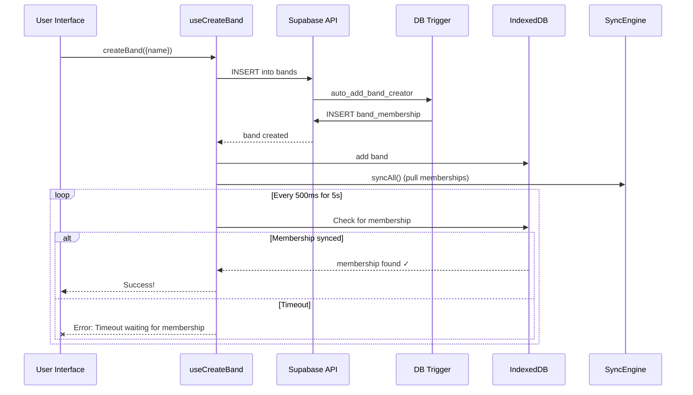
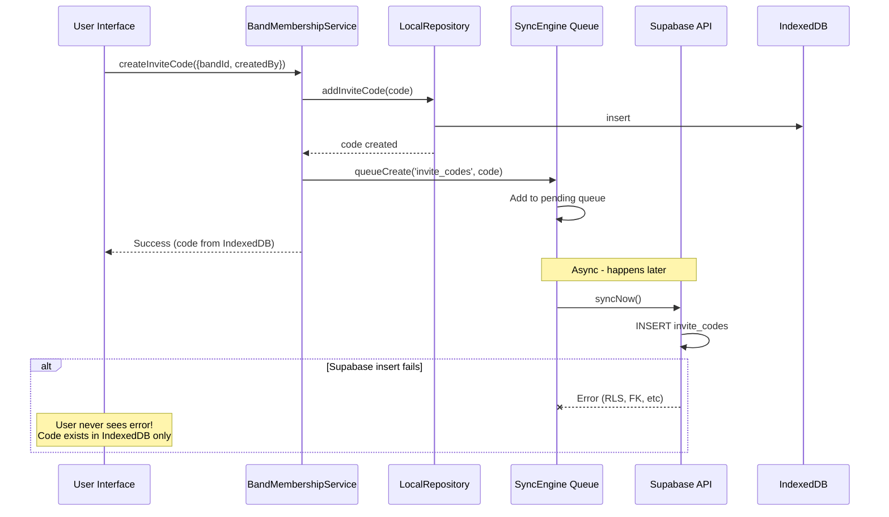
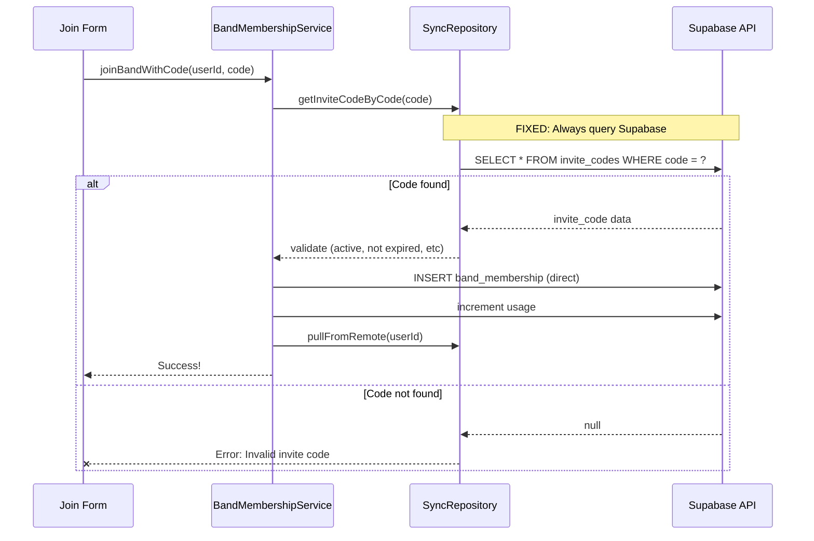
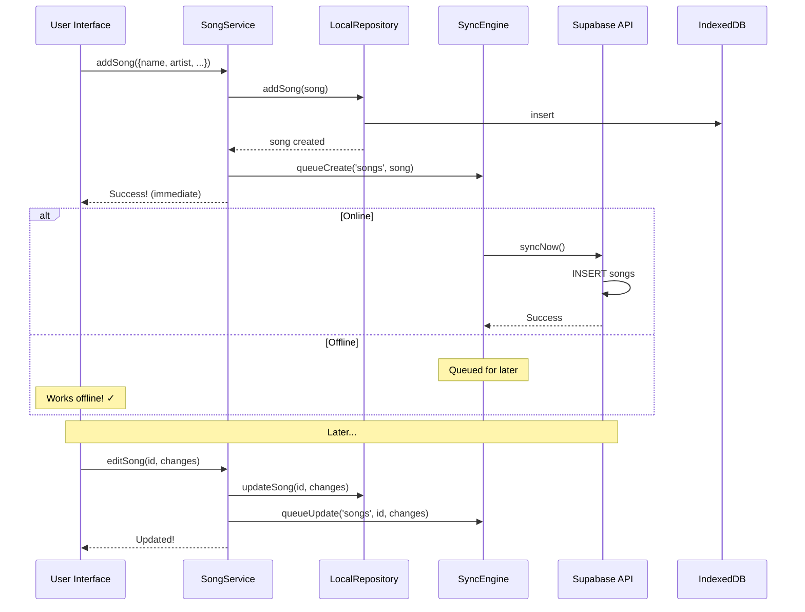

# Database Sync Architecture Analysis

**Created**: 2025-11-20T17:00
**Purpose**: Analyze current sync flows and determine optimal strategy for each entity type
**Status**: Analysis Complete - Recommendations Provided

## Executive Summary

**Current Issue**: Band creation and membership operations use async sync queue, causing race conditions in tests and unnecessary complexity.

**Key Finding**: Not all entities need offline-first sync. Band/membership operations are inherently online-only.

**Recommendation**: Split entities into two categories:
1. **Direct Supabase** (online-only): bands, band_memberships, invite_codes, users
2. **Sync Engine** (offline-capable): songs, setlists, shows, practice_sessions

---

## Current Architecture

### Sync Engine Overview

```
┌─────────────┐
│   Client    │
│ (IndexedDB) │
└──────┬──────┘
       │
       ▼
┌──────────────────┐
│ SyncRepository   │ ← Orchestrates sync
└──────┬───────────┘
       │
       ├──────────────┐
       │              │
       ▼              ▼
┌─────────────┐  ┌──────────────┐
│   Local     │  │   Remote     │
│ Repository  │  │  Repository  │
│ (IndexedDB) │  │  (Supabase)  │
└─────────────┘  └──────────────┘
       │              │
       └──────┬───────┘
              ▼
       ┌─────────────┐
       │ SyncEngine  │
       │  (Queue)    │
       └─────────────┘
```

### Current Flow Categories

**All entities currently use the same flow:**
1. Write to IndexedDB first (instant)
2. Queue for Supabase sync (async)
3. Sync engine processes queue
4. Pull from Supabase on next sync

---

## Detailed Flow Analysis

### 1. Band Creation (Current Flow)



**Current Issues:**
- ❌ Race condition: Membership created in Supabase but not yet in IndexedDB
- ❌ 5-second timeout can fail even when data is valid
- ❌ Tests fail due to sync timing
- ❌ Complex polling logic for what should be synchronous

**Pros:**
- ✅ Consistent with other entities

**Cons:**
- ❌ Band creation is inherently online (can't create band offline)
- ❌ Adds unnecessary complexity
- ❌ Race conditions in tests
- ❌ Confusing error messages

---

### 2. Invite Code Creation (Current Flow)



**Current Issues:**
- ❌ Code created in IndexedDB but might fail Supabase insert silently
- ❌ User sees success even if cloud sync fails
- ❌ Other users can't see the invite code
- ❌ Invite codes are online-only (can't share offline)

**Pros:**
- ✅ Fast UI response

**Cons:**
- ❌ Silent failures
- ❌ Data inconsistency
- ❌ No value in offline capability

---

### 3. Invite Code Validation (Current Flow - FIXED)



**Fixed Issues:**
- ✅ No longer falls back to IndexedDB
- ✅ Always queries source of truth
- ✅ Proper error messages

**Remaining Issues:**
- ❌ Still uses sync for creation (previous flow)

---

### 4. Song Management (Current Flow)



**This Flow is CORRECT:**
- ✅ Songs can be created/edited offline
- ✅ Changes sync when online
- ✅ No race conditions (songs are user-created content)
- ✅ Queue makes sense here

**Pros:**
- ✅ True offline-first capability
- ✅ Instant UI response
- ✅ Background sync
- ✅ Conflict resolution (versioning)

**Cons:**
- ✅ None - this is the right approach for content

---

## Entity Type Analysis

### Online-Only Entities (Should NOT use sync)

| Entity | Why Online-Only | Current | Recommended |
|--------|----------------|---------|-------------|
| **bands** | Can't create band without server | ❌ Sync Queue | ✅ Direct Supabase |
| **band_memberships** | Multi-user coordination required | ❌ Sync Queue | ✅ Direct Supabase |
| **invite_codes** | Must be shared across users | ❌ Sync Queue (create) | ✅ Direct Supabase |
| **users** | Auth-dependent | ❌ Sync Queue | ✅ Direct Supabase |
| **user_profiles** | Tied to auth | ❌ Sync Queue | ✅ Direct Supabase |

**Reasoning:**
- These entities require multi-user coordination
- No value in offline capability
- Creating them offline would be misleading
- Simpler flows = fewer bugs

---

### Offline-Capable Entities (Should use sync)

| Entity | Why Offline-Capable | Current | Keep? |
|--------|---------------------|---------|-------|
| **songs** | User-created content, can be drafted offline | ✅ Sync Queue | ✅ Yes |
| **setlists** | Can be planned offline | ✅ Sync Queue | ✅ Yes |
| **shows** | Can be created/updated offline | ✅ Sync Queue | ✅ Yes |
| **practice_sessions** | Can log sessions offline | ✅ Sync Queue | ✅ Yes |

**Reasoning:**
- These are content/activity records
- Users may want to work offline (tour bus, airplane, basement)
- Sync queue provides value
- Offline-first makes sense

---

## Recommended Architecture Changes

### Proposed Split Architecture

```
┌─────────────────────────────────────────┐
│           Client Application            │
└─────────────┬───────────────────────────┘
              │
    ┌─────────┴─────────┐
    │                   │
    ▼                   ▼
┌───────────┐      ┌────────────────┐
│  Direct   │      │  Sync Engine   │
│ Supabase  │      │   (Queue)      │
└─────┬─────┘      └────────┬───────┘
      │                     │
      │                     ├─────────────┐
      │                     │             │
      ▼                     ▼             ▼
┌─────────────┐      ┌──────────┐  ┌──────────┐
│  Supabase   │      │IndexedDB │  │ Supabase │
│   (bands,   │      │ (songs,  │  │ (songs,  │
│memberships, │      │setlists, │  │setlists, │
│   codes)    │      │ etc)     │  │  etc)    │
└─────────────┘      └──────────┘  └──────────┘
```

### Implementation Changes

#### 1. Band Creation (Proposed)

```typescript
// src/hooks/useBands.ts
async function createBandInSupabase(bandInput) {
  const supabase = getSupabaseClient()

  // Direct insert to Supabase
  const { data: band, error } = await supabase
    .from('bands')
    .insert({...bandInput})
    .select()
    .single()

  if (error) throw error

  // Wait for trigger to create membership (direct query)
  const membership = await waitForMembershipInSupabase(band.id, auth.uid())

  // Now pull both to IndexedDB for caching
  await db.bands.add(band)
  await db.bandMemberships.add(membership)

  return band
}

async function waitForMembershipInSupabase(bandId, userId) {
  // Query Supabase directly (no IndexedDB polling)
  for (let i = 0; i < 10; i++) {
    const { data } = await supabase
      .from('band_memberships')
      .select('*')
      .eq('user_id', userId)
      .eq('band_id', bandId)
      .single()

    if (data) return data
    await sleep(500)
  }

  throw new Error('Membership not created by trigger')
}
```

**Benefits:**
- ✅ Synchronous flow (no race conditions)
- ✅ Immediate error feedback
- ✅ Tests pass reliably
- ✅ Simpler code
- ✅ Still caches to IndexedDB for reads

---

#### 2. Invite Code Creation (Proposed)

```typescript
// src/services/BandMembershipService.ts
static async createInviteCode(request) {
  const code = this.generateCode()
  const supabase = getSupabaseClient()

  // Direct insert to Supabase (not queued)
  const { data, error } = await supabase
    .from('invite_codes')
    .insert({
      code,
      band_id: request.bandId,
      created_by: request.createdBy,
      expires_at: request.expiresAt,
      max_uses: request.maxUses || 10,
      is_active: true,
      current_uses: 0,
    })
    .select()
    .single()

  if (error) {
    // User sees actual error immediately
    throw new Error(`Failed to create invite code: ${error.message}`)
  }

  // Cache in IndexedDB for offline reads (optional)
  await db.inviteCodes.add(convertToAppFormat(data))

  return convertToAppFormat(data)
}
```

**Benefits:**
- ✅ No silent failures
- ✅ Immediate error feedback
- ✅ Code guaranteed in Supabase
- ✅ Other users can see immediately

---

#### 3. Song Management (Keep Current)

```typescript
// src/services/SongService.ts - NO CHANGES NEEDED
static async createSong(songData) {
  const song = {...songData, id: crypto.randomUUID()}

  // Write to IndexedDB first (offline-capable)
  await db.songs.add(song)

  // Queue for Supabase sync
  await syncEngine.queueCreate('songs', song)
  if (navigator.onLine) {
    syncEngine.syncNow()
  }

  return song
}
```

**This is correct - no changes needed!**

---

## Migration Strategy

### Phase 1: Critical Path (Bands & Memberships)

**Files to Change:**
1. `src/hooks/useBands.ts` - Band creation
2. `src/services/BandMembershipService.ts` - Invite codes, joining
3. `tests/fixtures/bands.ts` - Test helpers

**Steps:**
1. Create `createBandDirect()` function (bypasses sync)
2. Update `useCreateBand` to use direct creation
3. Update `createInviteCode()` to use direct insert
4. Update tests to expect synchronous behavior
5. Run E2E tests to verify

**Risk:** Low - only affects band creation flow
**Impact:** High - fixes race conditions immediately

---

### Phase 2: Cleanup (Remove from Sync Engine)

**Files to Change:**
1. `src/services/data/SyncRepository.ts` - Remove band/membership methods
2. `src/services/data/SyncEngine.ts` - Remove from sync tables

**Steps:**
1. Mark `addBand()`, `addBandMembership()` as deprecated
2. Remove from sync queue processing
3. Remove from conflict resolution

**Risk:** Low - direct methods already in place
**Impact:** Medium - reduces code complexity

---

### Phase 3: Documentation

**Files to Create/Update:**
1. `/dev/dashboard` - Add architecture diagrams
2. `CLAUDE.md` - Update sync architecture section
3. Comments in code

---

## Comparison: Before vs After

### Band Creation

| Aspect | Current (Sync Queue) | Proposed (Direct Supabase) |
|--------|---------------------|----------------------------|
| **Flow Complexity** | 🔴 High (async queue, polling) | 🟢 Low (synchronous) |
| **Error Handling** | 🔴 Delayed/Silent | 🟢 Immediate |
| **Test Reliability** | 🔴 Race conditions | 🟢 Deterministic |
| **User Experience** | 🟡 Fast but misleading | 🟢 Clear feedback |
| **Code Maintainability** | 🔴 Complex | 🟢 Simple |
| **Offline Capability** | 🟡 Exists but useless | 🟢 N/A (online-only) |

---

### Invite Code Creation

| Aspect | Current (Sync Queue) | Proposed (Direct Supabase) |
|--------|---------------------|----------------------------|
| **Success Guarantee** | 🔴 No (silent failures) | 🟢 Yes |
| **Multi-user Visibility** | 🔴 Delayed | 🟢 Immediate |
| **Error Messages** | 🔴 None or delayed | 🟢 Immediate |
| **Code Complexity** | 🔴 Medium | 🟢 Low |

---

### Songs (No Change Recommended)

| Aspect | Current (Sync Queue) | Alternative (Direct) |
|--------|---------------------|----------------------|
| **Offline Capability** | 🟢 Yes | 🔴 No |
| **User Experience** | 🟢 Fast, works offline | 🔴 Requires connection |
| **Value Proposition** | 🟢 Real benefit | 🔴 No benefit |
| **Complexity** | 🟡 Medium (but justified) | 🟢 Low |

**Decision:** Keep sync queue for songs ✅

---

## Testing Strategy

### Unit Tests

```typescript
describe('Band Creation (Direct Supabase)', () => {
  it('should create band and membership synchronously', async () => {
    const band = await createBandDirect({ name: 'Test Band' })

    // Verify in Supabase immediately
    const { data } = await supabase
      .from('bands')
      .select('*, band_memberships(*)')
      .eq('id', band.id)
      .single()

    expect(data).toBeDefined()
    expect(data.band_memberships).toHaveLength(1)
    expect(data.band_memberships[0].role).toBe('admin')
  })

  it('should throw error if Supabase insert fails', async () => {
    // Mock Supabase error
    await expect(createBandDirect({ name: '' }))
      .rejects
      .toThrow('Failed to create band')
  })
})
```

---

### E2E Tests

```typescript
test('new user can join existing band via invite code', async ({ browser }) => {
  // No longer needs to wait for sync!

  const user1 = await signUpViaUI(page1, createTestUser())
  const band = await createBandViaUI(page1, 'Test Band')

  // Invite code exists immediately in Supabase
  const inviteCode = await getInviteCodeViaUI(page1)

  const user2 = await signUpViaUI(page2, createTestUser())
  await joinBandViaUI(page2, inviteCode)

  // Success - no race conditions!
  await expect(page2).toHaveURL(/\/songs/)
})
```

---

## Risks & Mitigation

### Risk 1: Breaking Existing Flows

**Mitigation:**
- Keep old sync methods as deprecated
- Gradual migration (bands first, then codes)
- Comprehensive testing

### Risk 2: User Confusion (Online Requirement)

**Mitigation:**
- Clear error messages: "Creating a band requires an internet connection"
- Detect offline state before attempting
- Show connection indicator in UI

### Risk 3: Performance (More Supabase Calls)

**Mitigation:**
- Still cache reads in IndexedDB
- Batch operations where possible
- Monitor RPC counts

---

## Recommendations

### Immediate Actions (This Sprint)

1. ✅ **Fix band creation flow** - Use direct Supabase insert
2. ✅ **Fix invite code creation** - Use direct Supabase insert
3. ✅ **Update E2E tests** - Remove sync polling logic
4. ✅ **Add error handling** - Show clear messages for failures

### Short-term (Next Sprint)

1. Clean up sync repository (remove band/membership methods)
2. Add connection detection UI
3. Document architecture in /dev/dashboard
4. Update CLAUDE.md

### Long-term (Future)

1. Consider: Should user_profiles also be direct?
2. Monitor: Are there other entities that should be direct?
3. Optimize: Reduce Supabase RPC count via batching

---

## Conclusion

**Current Problem:** Band creation and invite codes use async sync queue, causing race conditions and silent failures.

**Root Cause:** All entities treated the same (offline-first), even when online-only makes more sense.

**Solution:** Split entities by use case:
- **Direct Supabase**: bands, memberships, invite codes (online-only operations)
- **Sync Engine**: songs, setlists, shows, sessions (offline-capable content)

**Expected Outcomes:**
- ✅ E2E tests pass reliably
- ✅ Clearer error messages
- ✅ Simpler codebase
- ✅ Better user experience
- ✅ Still maintains offline capability where it matters (songs, etc.)

**Next Step:** Implement Phase 1 changes for band creation and invite codes.

---

## Appendix: Current File Structure

```
src/
├── services/
│   ├── data/
│   │   ├── SyncRepository.ts       ← Remove band/membership methods
│   │   ├── RemoteRepository.ts     ← Keep for songs
│   │   ├── LocalRepository.ts      ← Keep for caching
│   │   └── SyncEngine.ts           ← Remove bands from sync
│   ├── BandService.ts              ← Deprecated (move to hooks)
│   └── BandMembershipService.ts    ← Update to direct Supabase
├── hooks/
│   └── useBands.ts                 ← Update createBandInSupabase
└── models/
    ├── Band.ts
    └── BandMembership.ts
```

---

**Document Status**: Ready for implementation
**Approval Needed**: Yes - architectural decision
**Estimated Effort**: 4-6 hours
**Risk Level**: Low-Medium
